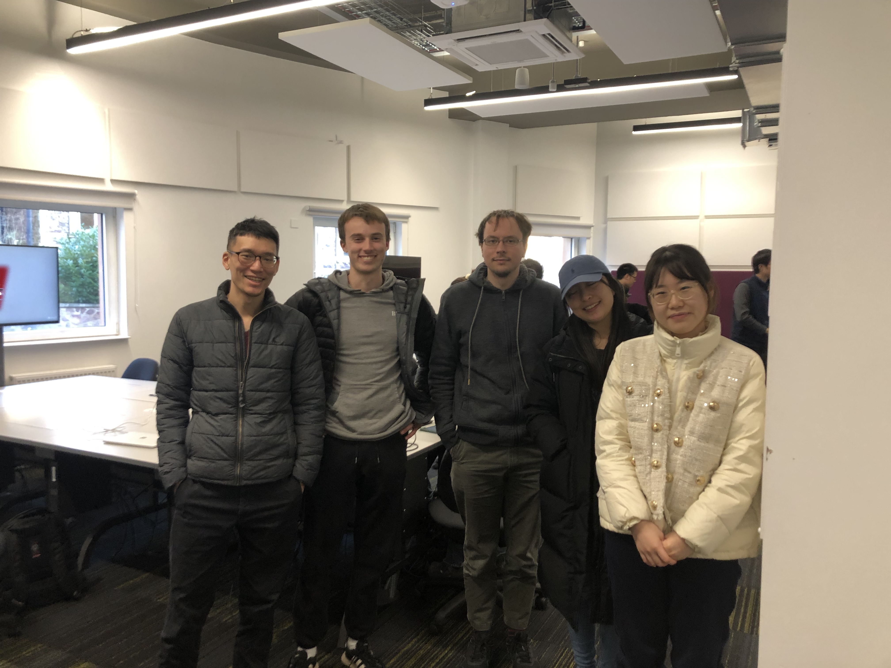

# Members

- JeremyWang([@GoatWang](https://github.com/GoatWang))
- Ben Collingwood([@BCollingwd](https://github.com/BCollingwd))
- Conrad([@oo22625](https://github.com/oo22625))
- Xufeng Yin([@07536220107](https://github.com/07536220107))
- Ya02111([@Ya02111](https://github.com/Ya02111))

# Our Proposal


# Git Process
1. Create branch and start develop.
```
git checkout -b '<branch_name>'
```

2. pull and merge branch.
```
git checkout master
git pull 
git merge '<branch_name>'
```

3. push
```
git push
```

