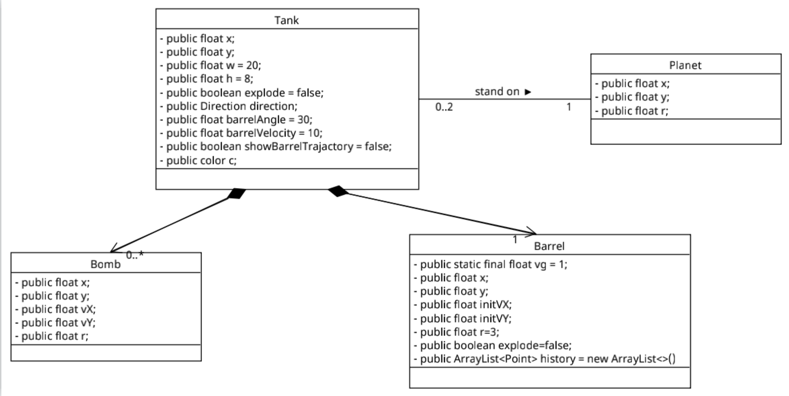

# Members

- JeremyWang([@GoatWang](https://github.com/GoatWang))
- Ben Collingwood([@BCollingwd](https://github.com/BCollingwd))
- Conrad([@oo22625](https://github.com/oo22625))
- Xufeng Yin([@07536220107](https://github.com/07536220107))
- Ya02111([@Ya02111](https://github.com/Ya02111))

# Proposal
- [Brick Dragon Video](/static/IMG_0487_compressed.mov)
- [Tank Script Storyboard](/static/SpaceTanksPaperPrototype)

# Project Plan
- [Hackmd](https://hackmd.io/@836ko9MsR8aI9djOlrFkYg/HJP_qgZCj)

# Git Process
1. Create branch and start develop.
```
git checkout -b '<branch_name>'
```

2. check you are on the right branch
```
git branch
```

3. commit the change 
```
git add .
git commit -m "<message>"
```

4. push: 
```
# first time you push the brach
git push -u origin <branch>

# if the branch has been recognized be the remote
git push
```

5. merge: do this after confirmed by all members of the team
```
git checkout master
git pull 
git merge '<branch_name>'
```

# Diagrams



